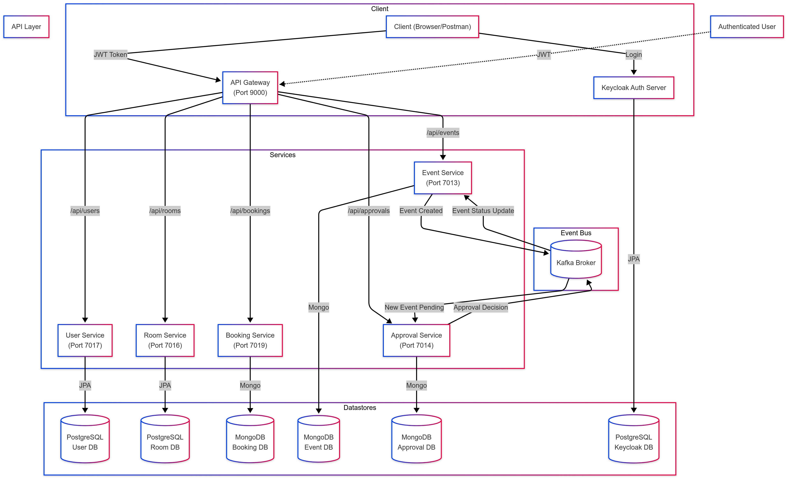

# GBC EventBooking System
## Project Overview

The **GBC EventBooking System** is a microservices-based room booking and event management platform for George Brown College. It allows students, staff, and faculty to book campus rooms for meetings and events, and manages the entire process from room scheduling to event approval​. 
The system is composed of several independent services (for users, rooms, bookings, events, approvals) that work together to handle bookings and enforce college policies (e.g. requiring staff approval for certain events). This architecture ensures each service is focused on a specific business domain, enabling better scalability and maintainability.

Key features of the platform include:

- Room Booking – Users can search for available rooms and reserve them for specified time slots.
- Event Management – Events can be created and linked to room bookings (with details like event name, type, etc.), facilitating organized event planning.
- Approval Workflow – Certain event requests (e.g. those created by students) require approval by staff before final confirmation.
- User Profiles – Management of user information and roles (student, faculty, staff) which drive access control (only staff can approve events, etc.).
- Central API Gateway – A gateway that routes API calls to the appropriate microservice, providing a single entry point for clients and handling concerns like authentication.
- Security – Integration with Keycloak for authentication and authorization, ensuring that only authorized users can perform actions (with role-based access control for approvals).

Overall, the EventBooking system demonstrates a full-stack distributed application with **Spring Boot microservices**, **RESTful APIs**, **inter-service communication** (including event-driven messaging), and **containerization** for easy deployment.

## Microservices Breakdown

The project is divided into multiple Spring Boot microservices, each responsible for a specific domain in the event booking process. Below is an overview of each microservice, including its purpose, technologies, and main endpoints:

### User Service

**Purpose**: Manages user accounts and profiles for students, staff, and faculty​
. This service stores user details and handles user-related operations (except authentication, which is handled by Keycloak). It enforces role-based access by marking users with roles (e.g. only staff have permission to approve events).

**Technologies**: Implemented with Spring Boot and Spring Data JPA. Uses a PostgreSQL database to persist user information​
. The service utilizes Spring Security (with Keycloak) to secure its endpoints, ensuring that user data is protected.

**Key Endpoints**: (HTTP REST endpoints for managing users)

- ```GET /users``` – Retrieve a list of all user profiles.
- ```GET /users/{id}``` – Get details of a specific user by ID.
- ```POST /users``` – Create a new user account (e.g. when onboarding a new person).
- ```PUT /users/{id}``` – Update an existing user’s information.
- ```DELETE /users/{id}``` – Remove a user (if applicable, e.g. account deletion or cleanup).

Each user record includes fields such as _name, email, role, and userType_ (indicating student/staff/faculty)​. 


### Room Service

**Purpose**: Manages room resources and their availability​
. This service keeps track of room details like capacity and features, and knows whether a room is available for booking at given times. It provides information to users about available rooms and coordinates with the Booking Service to prevent double-booking.

**Technologies**: Built with Spring Boot and Spring Data JPA, using PostgreSQL for persistent storage of room data​
. The data model includes attributes such as _roomName, capacity, features_ (e.g. projector, whiteboard), and _availability status​_
.

**Key Endpoints**:

  - ```GET /room``` – Retrieve all rooms with their details.
  - ```GET /room/{id}``` – Get information on a specific room.
  - ```POST /room``` – Add a new room to the inventory (including its capacity and features).
  - ```PUT /room/{id}``` – Update details of an existing room (e.g. changing capacity or features).
  - ```DELETE /room/{id}``` – Remove a room from the system.

### Booking Service

**Purpose**: Handles room booking requests and manages booking records​
. It is the core service that users interact with to reserve a room. The Booking Service ensures that no conflicting bookings occur for the same room and time (preventing double-booking​
), and it stores details of each reservation.

**Technologies**: Implemented with Spring Boot and uses Spring Data **MongoDB** for persistence​
. Booking data is stored in a MongoDB database, which is suitable for the JSON-like structure of booking records. This service may use Kafka to publish events (e.g. notifying other services of a new booking, if needed) but primarily interacts synchronously with Room and User services for validation (e.g. to confirm a user and room exist).

Each booking entry typically includes: _ownerId, roomId, startTime, endTime_, and purpose of the booking​
. Using these, the service can detect overlaps and enforce scheduling rules.

**Key Endpoints**:

  - ```GET /booking``` – List all bookings.
  - ```GET /booking/{id}``` – Get details of a specific booking (including room, user, time).
  - ```POST /booking``` – Create a new booking (reserve a room). The request would include ```roomId```, ```userId```, start and end time, etc. The service will check that the room is free during that interval before confirming.
  - ```PUT /booking/{id}``` – Modify an existing booking (e.g. change time or purpose). This would also trigger a availability check for conflicts.
  - ```DELETE /booking/{id}``` – Cancel a booking.

**Room Availability Check**: The Booking Service provides functionality to check if a room is available in a given time range.

Behind the scenes, when a booking is created, the service may notify the Event Service (if an event is to be associated) or simply allow an Event to be created later referencing this booking. The Booking Service is crucial in maintaining the schedule of all rooms.

### Event Service

**Purpose**: Manages events that are linked to bookings​
. An "event" in this context contains additional information about the meeting or occasion taking place in a booked room. For example, if a room is booked for a club meeting, the Event Service would store details of that event (meeting name, type, expected attendees, etc.) and track whether it’s approved by staff.

**Technologies**: Built with Spring Boot and Spring Data MongoDB, using a MongoDB database​
. This allows flexible storage of event details. The Event Service communicates with the Room Service to ensure every event is tied to a valid room (e.g. via a room ID). It also integrates with the Approval Service: when certain events are created, they may require an approval step.

Event data fields _include eventName, organizerId, eventType, and expectedAttendees​_
, as well as a reference to the associated _roomId_ (linking the event to a specific room and time slot). The _organizerId_ is the user who created the event (should match the user's userId).

**Key Endpoints**:

  - ```GET /events``` – List all events.
  - ```GET /events/{id}``` – Get details of a specific event, including its linked booking info and approval status.
  - ```POST /events``` – Create a new event. This request would include event details (name, type, etc.) and typically a reference to an existing room (roomId). Upon creation, if the event requires approval (e.g. organizer is a student or eventType triggers policy), the service will mark it as pending approval and **emit an event** (via Kafka or direct call) to the Approval Service.
  - ```PUT /events/{id}``` – Update an event’s information (e.g. changing event name or details).
  - ```DELETE /events/{id}``` – Cancel an event. This might also remove any pending approval requests associated with it.

When an event is created, the Event Service coordinates with the Approval workflow. In an event-driven implementation, it might publish a message like "EventCreated" on a message broker (Kafka), which the Approval Service listens for. 
Alternatively, it could call the Approval Service’s API to create an approval request. In either case, the Event Service is aware of the approval status of its events (e.g., an event record may have a field ```approved=false``` until updated by the Approval Service).

### Approval Service

**Purpose**: Handles the approval process for events, enforcing college policies that require certain events to be reviewed by staff​
. This service allows staff members to approve or reject event requests. It ensures that only authorized users (staff/faculty) can make approval decisions and that those decisions are recorded and communicated back to the Event Service.

**Technologies**: Implemented with Spring Boot. The persistence could be either MongoDB or PostgreSQL – the choice was left open in the design​
, but the project uses MongoDB (consistent with other services requiring flexible data storage). The Approval Service uses Kafka messaging to receive new event requests and to send back approval outcomes asynchronously. It maintains a collection of approval records, each linked to an event. Fields include _eventId_ (or the event details), the _status_ of the request (pending/approved/rejected), and _approver_ information (who approved/rejected, and when).

**Key Endpoints**:

  - ```GET /approvals``` – List all event approval requests. 
  - ```GET /approvals/{id}``` – Get details of a specific approval request (including the event info and current status).
  - ```PUT /approvals/{id}``` – Update an approval request. This is how an approver would record their decision. For example, the request body might carry a field like ```status: "APPROVED"``` or ```"REJECTED"```. Alternatively, dedicated endpoints could be used:
    - ```PUT /approvals/{id}/approve``` – Mark a pending request as approved.
    - ```PUT /approvals/{id}/reject``` – Mark a pending request as rejected.

When an approval decision is made, the Approval Service will communicate the outcome back to the Event Service. In an event-driven design, it might publish an "EventApproved" or "EventRejected" message via Kafka. The Event Service, upon receiving that, would update the event’s status (so that, for example, the event can be marked as confirmed and visible to users). This decoupling allows the approval process to happen asynchronously. Only users with the staff role (as verified by Keycloak tokens) are authorized to hit the approval decision endpoints.

### API Gateway

**Purpose**: Serves as a single entry point for all clients (e.g. web or mobile frontends or API consumers) to interact with the microservices. The API Gateway routes incoming HTTP requests to the appropriate microservice based on the URL path or other routing rules. It also centralizes concerns like authentication, authorization, and CORS configuration so that individual services can remain focused on core logic.

**Technologies**: The gateway is built with Spring Cloud Gateway (running on Spring Boot). It uses Java and Spring’s reactive routing to forward requests. The gateway is containerized like the other services. It listens on a common port (e.g. port **9000** as configured in Docker) for incoming requests.

**Routing & Endpoints**: Clients do not directly call the internal services (which run on separate ports); instead, all calls go to the API Gateway on port 9000. The gateway then forwards the request to the correct service. For example:

  - Requests to ```/api/users/**``` are forwarded to the User Service (port 7017) for user-related endpoints.
  - ```/api/rooms/**``` -> Room Service (7016).
  - ```/api/bookings/**``` -> Booking Service (7019).
  - ```/api/events/**``` -> Event Service (7013).
  - ```/api/approvals/**``` -> Approval Service (7014).

The gateway defines these routes in its configuration. It may also handle **load balancing** (not needed here since one instance of each service). Another important role is **security**: the gateway can verify JWT tokens issued by Keycloak on each request. Essentially, after a user logs in via Keycloak and obtains a token, every request with that token goes through the gateway which can check its validity and the user’s roles before allowing it to reach the downstream service.

By using an API Gateway, the system can present a clean unified API to consumers and hide the complexity of multiple services. It also makes it easier to enforce consistent policies (like requiring authentication for all endpoints, or rate limiting) in one place.

## Installation & Setup Guide

Follow these steps to set up and run the GBC EventBooking system on your local machine or server. The project uses Docker for easy deployment, but you can also run services directly if needed.

### 1. Prerequisites

Ensure you have the following software installed on your system:

  - Java Development Kit (JDK) – at least Java 17 (for running Spring Boot services)​.
  - Gradle – used as the build tool (the project includes Gradle Wrapper scripts, so having Gradle installed is optional)​.
  - Docker and Docker Compose – for containerizing and running the microservices and supporting services​.
  - MongoDB & PostgreSQL – If not using Docker, you’ll need local instances of MongoDB and PostgreSQL (with appropriate databases for each service). Docker Compose will set these up automatically in containers.
  - Keycloak – (Optional) If you plan to use an external Keycloak, otherwise the Docker setup will launch a Keycloak container for you.

### 2. Clone the Repository

Clone the project from GitHub:
```bash
git clone https://github.com/oHastee/GBC_EventBooking-Group42.git
cd GBC_EventBooking-Group42
```

This will fetch all microservices and configuration files.
### 3. Configuration

The repository contains default configurations for development and Docker. Key configuration files:

  - Each microservice has an ```application.properties``` or ```application.yml```. These define database connection settings, Kafka topics, etc. The Docker profile is set up to use the container hostnames defined in ```docker-compose.yml```.
  - **Docker Compose Configuration**: The ```docker-compose.yml``` in the root defines all services, networks, and volumes. It sets environment variables for each container:
    - MongoDB containers for Booking, Event, Approval (with ports 27317, 27117, 27217 respectively).
    - PostgreSQL containers for User and Room (on ports 5445 and 5444).
    - A Keycloak container on port 8080 (with a predefined admin user and a realm import).
    - The API Gateway and each microservice container (User, Room, Booking, Event, Approval) with their respective internal ports (7017, 7016, 7019, 7013, 7014).
  - **Keycloak Setup**: A Keycloak realm configuration is provided under realms/ (mounted into the Keycloak container). This defines the realm (e.g. "EventBookingRealm"), client settings, and roles (student, staff, faculty). The Keycloak container will import this on startup​
    github.com
    . If running Keycloak separately, you should create a realm and configure clients/roles to match what the services expect (client IDs, realm name, etc., which would be referenced in the services’ application.properties).

By default, the services are configured to connect to the databases and Kafka using the hostnames from the compose file (e.g., ```postgres-user```, ```mongodb-gbc-booking```, etc.), under the Docker profile.

### 4. Building the Services

Each microservice is a Gradle sub-project. You can build the entire project with the Gradle Wrapper:

```./gradlew clean build```

This will compile all services and run any tests. The build outputs (JAR files) will be in each service’s ```build/libs``` directory. The Docker Compose setup will also build Docker images using the included Dockerfiles, which rely on these JARs.

_(If you plan to run services without Docker, you can skip Docker-specific steps. Ensure you have the databases running and adjust ```application.properties``` for hostnames/ports as needed. Then start each service by running its JAR or via an IDE.)_

### 5. Running with Docker Compose (All Services)

The easiest way to start the whole system is with Docker Compose:

```docker-compose up --build```

This command will:

  - Build Docker images for all microservices and the API gateway.
  - Start containers for: User Service, Room Service, Booking Service, Event Service, Approval Service, API Gateway.
  - Start containers for MongoDB (three instances for the services), PostgreSQL (two instances for services), Keycloak, Zookeeper & Kafka (for the event bus), and a Kafka UI (for monitoring events).

The ```--build``` flag ensures any code changes are built into images. On first run, it will also download the base images (like Java, Mongo, Postgres, Keycloak, Kafka).

Give the containers a minute or two to initialize. Keycloak will import the realm on first startup (so it has the users/roles configured), and databases will run init scripts (see the ```init/``` folder) to set up initial schema.

### 6. Verifying the Setup

Once all containers are running:

  - API Gateway: Accessible at http://localhost:9000. (It doesn't have a direct UI, but you can ping for health or simply use it for API calls.)
  - Keycloak: Access the Keycloak Admin Console at http://localhost:8080 (with default admin/admin as per env settings​). You can see the realm (e.g., "EventBooking") and user roles.
  - Databases:
    - PostgreSQL for users and rooms on localhost ports 5445, 5444 (you can connect with psql or any DB tool using user "admin" and password "password" as per compose file).
    - MongoDB for other services on ports 27317, 27117, 27217 (admin/password credentials).
  - Kafka: A Kafka broker is running internally (not exposed to host) and Kafka UI is accessible at http://localhost:8080 as well (Note: Kafka UI might be mapped to a different port if configured, check docker-compose.yml for kafka-ui service port mapping, which might also be 8080 causing a clash with Keycloak. If so, adjust one of them).

Check logs of each service container to ensure they started without errors:

```bash
docker-compose logs user-service
docker-compose logs booking-service
```

etc. You should see each service up and listening on its port, and messages indicating successful connections to databases and the message broker.

### 7. Usage

Now you can interact with the system via the API Gateway. For example:

  - Register or insert some users (unless preloaded) via the User Service API.
  - Add some rooms via Room Service.
  - Make booking requests via Booking Service.
  - Create events via Event Service.
  - Approve events via Approval Service (using a staff user account).

It's convenient to use **Postman** or a similar tool to test the APIs. A Postman collection (postman.zip) is provided with preset requests for all endpoints, which you can import to quickly get started. Make sure to obtain an access token from Keycloak (using the realm’s login) and include it in your API requests (typically as an Authorization Bearer token) to authenticate.

_(If not using Docker: start each microservice by running its Spring Boot application. Also start a Keycloak server and create the required realm/clients. Ensure the application.properties of each service points to the correct DB host/port. Then use the same steps to test via the API gateway or directly to service ports.)_

### 8. Shutdown

To stop the system, press ```Ctrl+C``` if running Compose in foreground, or use:

```docker-compose down```

This will stop and remove the containers. Data in databases will persist in the ./data/ directory (mounted as volumes), so subsequent ``up`` will reuse existing data. If you want a fresh start, you can remove the ```data``` directory and the Keycloak import volume.

## Architecture Diagram

The following diagram illustrates the high-level architecture and interactions between the microservices in the GBC EventBooking system:



Explanation: All client requests go through the **API Gateway**, which then forwards them to the appropriate service. The **User Service** and **Room Service** use their own PostgreSQL databases for persistence. The **Booking**, **Event**, and **Approval Services** each use their own MongoDB databases.

For **authentication**, the client first obtains a JWT token from **Keycloak** (not shown in detail in the diagram). Subsequent requests include this token, and the Gateway (and/or each service) validates the token to authorize the request.

The **dotted arrows** show the asynchronous event flow: when an event requiring approval is created, the Event Service publishes an event to **Apache Kafka**. The Approval Service, subscribed to those events, picks it up and creates an approval entry. A staff user then triggers an approval decision, upon which the Approval Service publishes an approval result event. The Event Service consumes that and updates the event’s status (approved or rejected). This decouples the services and allows the approval process to happen without blocking the original request.

Each microservice is independently deployable and runs in a Docker container. They communicate over HTTP (via the gateway or direct inter-service calls if needed) and Kafka for event messages. The architecture supports scaling each component and makes the system more resilient – for example, if the Approval Service is down, events can still be created and queued for later approval.

## API Documentation

This section provides a reference for the RESTful APIs exposed by each microservice. All endpoints are relative to the API Gateway base URL (e.g., ```http://<host>:9000/```), which proxies to the services. Assume that all requests require a valid Authorization token from Keycloak (Bearer JWT) and that proper roles are needed for certain operations (e.g., only staff can call approval endpoints).

For brevity, only the main endpoints and payload structures are described.

### User Service API

Base URL: ```/api/users``` (proxied to User Service)

**Endpoints**:

  - GET /api/users – Retrieve all users. Response: JSON array of user objects. Each user object contains:
    - id (unique identifier),
    - name,
    - email,
    - role (e.g. "Student", "Staff", "Faculty"),

    _Authorization_: Requires an authenticated request. The service may allow only staff/admin to list all users, depending on policy.

  - **GET** ```/api/users/{id}``` – Get a single user’s details by ID. **Response**: JSON of the user object if found. Returns: 404 if the user ID does not exist. Authentication required (users access their own profile, staff access any).

  - **POST** ```/api/users``` – Create a new user. **Request Body**: JSON with user details:

    ```bash
    {
      "name": "Alice Smith",
      "email": "alice@example.com",
      "role": "Student",
      "userType": "student"
    }
    ```

    On success, returns 201 Created with the created user JSON (including its generated ```id```). This might be used for admin-created accounts. (In many cases, user registration might be handled via Keycloak self-registration; here it’s manual.)

  - **PUT** ```/api/users/{id}``` – Update an existing user’s information. **Request Body**: JSON with fields to update (same structure as creation, but one can omit unchanged fields). Returns the updated user JSON or a success status. Note: Typically, users can update only their own info (and not roles), while admins can update anyone.

  - **DELETE** ```/api/users/{id}``` – Delete a user account. Returns 204 No Content on success. Only admins have access to this.

**Example**: To fetch the profile of user with id 5, you'd GET ```/api/users/5```. To create a user, POST to ```/api/users``` with the JSON body as above.

### Room Service API

Base URL: ```/api/rooms``` (proxied to Room Service)

**Endpoints**:

  - **GET** ```/api/rooms``` – Get a list of all rooms. Response: JSON array of room objects. Each room object includes:
      - ```id```,
      - ```roomName``` (or number/code),
      - ```capacity``` (number of people it can accommodate),
      - ```features``` (array of strings, e.g. ["Projector", "Whiteboard"]),
      - ```availability``` (boolean indicating if it's available)​. 

  - **GET** ```/api/rooms/{id}``` – Get details of a specific room by ID. **Response**: JSON of the room object. 404 if not found.

  - **POST** ```/api/rooms``` – Add a new room to the system. **Request Body**: JSON for the room:

    ```bash
    {
      "roomName": "Lecture Hall B",
      "capacity": 100,
      "features": ["Projector", "Sound System"],
      "availability": true
    }
    ```

    Returns the created room JSON with its assigned ```id```. Only admin/staff would use this (to register rooms).

  - **PUT** ```/api/rooms/{id}``` – Update an existing room’s info. **Body**: JSON with updated fields (same format as above). Returns the updated room data. (E.g., to mark a room unavailable or change its features.)

  - **DELETE** ```/api/rooms/{id}``` – Remove a room. Returns 204 on success. (Only allowed if the room has no future bookings, presumably. Otherwise, the service might respond with an error.)

### Booking Service API

Base URL: ```/api/bookings``` (proxied to Booking Service)

**Endpoints**:

  - **GET** ```/api/bookings``` – List all bookings. Response: JSON array of booking records. Each booking record includes:
    - ```id```,
    - ```roomId``` (which room is booked),
    - ```userId``` (who booked it),
    - ```startTime``` and ```endTime``` (timestamp/datetime for the reservation)​,
    - ```purpose``` (description) (what the booking is for)​,
    - possibly eventId if an event has been associated with this booking.

    This endpoint supports filters like ```?userId=``` to get bookings for a specific user, and ```?roomId=``` for a specific room, etc. Regular users would see only their own bookings.

  - **GET** ```/api/bookings/{id}``` – Get details of a specific booking by ID. **Response**: JSON of the booking object, including all fields and embedded roomID and userID.

  - **POST** ```/api/bookings``` – Create a new booking (reserve a room). **Request Body**: JSON with necessary booking info:
    ```bash
      {
        "roomId": 101,
        "userId": 5,
        "startTime": "2025-03-01T15:00:00",
        "endTime": "2025-03-01T16:00:00",
        "purpose": "Study Group Meeting"
      }
    ```
    In a real scenario, userId might be taken from the authenticated user’s token rather than passed in the body. On success, returns 201 Created with the booking record (including its id). If the room is already booked for any part of that interval, the service will return an error (HTTP 409 Conflict or a validation error) indicating a double-booking attempt​.
    The Booking Service ensures the new booking does not overlap with existing ones for the same room.

  - **PUT** ```/api/bookings/{id}``` – Update a booking’s details. This could allow changing the time or purpose. Body: JSON with updated fields (e.g. new endTime, etc). The service will re-check for conflicts if the time or room changed. Returns the updated booking JSON. If a change causes a conflict, it returns an error.

  - **DELETE** ```/api/bookings/{id}``` – Cancel a booking. On success, returns 204 No Content. This frees up the room slot for others. 

  - **GET** ```/api/bookings/check``` – _(If implemented)_ Check room availability (alternative method). As mentioned:
    - Example: ```/api/bookings/check?roomId=101&start=...&end=...```
    - Response: ```{ "available": true }``` or similar. This is essentially the same as the Room Service availability check.

**Example**: To book room 101 for user 5 on March 1, 2025 from 3-4 PM, a client would send a POST to ```/api/bookings``` with the JSON as above. If successful, they get back a booking object with an ID and they can then proceed to create an event for this booking if needed.

### Event Service API

Base URL: ```/api/events``` (proxied to Event Service)

**Endpoints**:

- **GET** /api/events – List all events. Response: JSON array of event objects. Each event object contains:
    - ```id```,
    - ```eventName```,
    - ```eventType``` (e.g. "Workshop", "Meeting", "Party"),
    - ```expectedAttendees``` (number of people expected)​,
    - ```organizerId``` (the user who created the event, likely the one who booked)​,
    - ```bookingId``` (reference to the associated booking/room and time),
    - ```approved``` or ```status``` (e.g. "Pending", "Approved", "Rejected"),

- **GET** ```/api/events/{id}``` – Get a specific event’s details by ID. **Response**: JSON of the event object including its status and related booking info.

- **POST** ```/api/events``` – Create a new event. **Request Body**: JSON with event details:
    ```bash
    {
      "eventName": "Tech Talk",
      "eventType": "Seminar",
      "expectedAttendees": 50,
      "roomId": 9
    }
    ```
    The ```roomId``` links this event to an existing room booking. The service will verify that the booking exists. It will also record the ```organizerId``` as the current user’s ID.

    **Response**: 201 Created with the event object. Initially, the event’s ```status``` will be "Pending".
  
    After creation, the Event Service triggers the approval workflow. Using Kafka, it publishes an "EventCreated" message including the event details or ID. The Approval Service will pick this up to create a corresponding approval request.

- **PUT** ```/api/events/{id}``` – Update an event’s details. **Body**: JSON with updated fields (allows changing expectedAttendees, or even attaching to a different booking if rescheduling). Approved events might not allow certain changes without re-approval. Returns the updated event JSON.

- **DELETE** ```/api/events/{id}``` – Cancel an event. This will delete the event record. If it was pending approval, the Approval request can be removed; if it was approved, it just means the event will not happen. Returns 204 on success.

**Example**: A student who created a booking might then create an event for that booking by sending a POST to ```/api/events``` with the bookingId and event info. The response will show the event is created with status "Pending". That student would then wait for a staff member to approve it via the Approval Service.

### Approval Service API

Base URL: ```/api/approvals``` (proxied to Approval Service)

**Endpoints**:

- **GET** ```/api/approvals``` – List all approval requests. **Response**: JSON array of approval records. Each record might contain:
  - ```id```,
  - ```eventId``` (the event that needs approval),
  - ```eventName``` and maybe summary info (for convenience),
  - ```requestedBy``` (organizer’s userId),
  - ```status``` ("PENDING", "APPROVED", "REJECTED"),
  - ```decisionBy``` (if decided, the userId of the staff who approved/rejected),
  - ```decisionDate```.

  Typically, only staff or admins can view all approvals. Staff might use this to see all pending requests.

- **GET** ```/api/approvals/{id}``` – Get a specific approval request by ID. **Response**: JSON of the approval object. Staff would use this to view details.

- **PUT/PATCH** ```/api/approvals/{id}``` – Update an approval. This is the primary way to approve or reject an event:
  - The client (staff user) provides in the request body something like ```{ "status": "APPROVED" }``` or ```{ "status": "REJECTED" }```. Alternatively, there are two separate endpoints for clarity:
    - **PUT** ```/api/approvals/{id}/approve``` – Mark as approved (the service sets status to approved and records who did it).
    - **PUT** ```/api/approvals/{id}/reject``` – Mark as rejected (service sets status to rejected).

  In either case, upon this action, the Approval Service will update its record, and importantly, notify the Event Service of the decision. If using events, it publishes a message (like "EventApproved" or "EventRejected" with the eventId and decision). The Event Service, upon receiving that, will update the event’s status in its database to reflect the decision.

  **Response**: Could be the updated approval object or just a 200 OK with no body. After this, the event is considered approved or not. If approved, the event can now be considered confirmed and visible as an upcoming event; if rejected, the event remains but marked as rejected.

**Security**: Only users with the staff role (or a specific "Approver" role) should be allowed to call the approval decision endpoints. This is enforced by Keycloak role checks in the token.

**Example**: A staff member opens the list of pending approvals via **GET** ```/api/approvals?status=PENDING```. They see an entry for event ID 456 (with details). To approve it, they call **PUT** ```/api/approvals/456/approve```. The service responds with 200 OK. Then the Event Service (listening to Kafka) will update event 456 status to "Approved". The student who created the event could be notified (last part not implemented in theory).

### Note on Authentication & Roles

All services are secured by Keycloak. That means you need to obtain a JWT by logging into Keycloak (for example, using Resource Owner Password flow or via the Keycloak UI in a real app) for a user with appropriate role:

  - Students can create bookings and events, view their own stuff.
  - Staff can do all of that plus approve events.
  - The API Gateway will typically enforce that a valid token is present.

The exact endpoints for authentication are handled by Keycloak (for example, token endpoint at Keycloak, not by our services). In testing, you might manually retrieve a token from Keycloak’s OpenID API and then include it in the **Authorization**: ```Bearer <token>``` header for all calls to the gateway.

## Technologies Used

The GBC EventBooking system uses a modern tech stack centered around Java Spring Boot and containerized microservices. Key technologies and frameworks include:

  - **Java & Spring Boot**: All microservices are written in Java (Spring Boot framework). Spring Boot starters are used for web (Spring MVC/REST), data access, and security. This provides embedded servers and an easy way to create stand-alone services.
  - **Spring Data JPA**: Used in User and Room services for ORM to PostgreSQL databases​. This simplifies database interactions by mapping Java entities to tables.
  - **Spring Data MongoDB**: Used in Booking, Event, Approval services to interact with MongoDB. This allows storing JSON-like documents for flexibility.
  - **Spring Cloud Gateway**: Used for the API Gateway to route requests to services and handle cross-cutting concerns (like auth). It is a part of Spring Cloud ecosystem for building API gateways.
  - **Spring Security with Keycloak (OAuth2/OpenID Connect)**: Keycloak is an open-source identity and access management server. It issues tokens to authenticate users. The services and gateway integrate with Keycloak adapters or OAuth2 resource server to protect endpoints. Keycloak manages user login, roles, and tokens.
  - **Databases**:
      - _PostgreSQL_ – Relational database used for storing structured data (user accounts, room info). Each of the two services has its own isolated Postgres instance (in Docker) to ensure separation of data.
      - _MongoDB_ – NoSQL database used for storing bookings, events, and approvals as documents. Each service has its own Mongo database. Using Mongo allows schema evolution and flexibility for these services.
  - **Apache Kafka**: Used as an event bus for inter-service communication, particularly between Event Service and Approval Service (and possibly to broadcast booking or user events if needed). Kafka enables asynchronous, decoupled communication where services publish events and others subscribe​.
  - **Docker & Docker Compose**: Containerization of all components ensures the application can run anywhere. Each service has a Dockerfile (likely using an OpenJDK image). Docker Compose defines the multi-container setup so all services, databases, Kafka, and Keycloak start with one command. This also helps in isolating each service’s environment (each service uses its own DB container, etc.).
  - **Gradle (Kotlin DSL)**: The project uses Gradle as the build system, with a Kotlin DSL build script (build.gradle.kts). This manages dependencies like Spring Boot starters, Lombok, etc., and organizes the project as a multi-module build.
  - **Lombok**: Used to reduce boilerplate in data models – this is a common choice in Spring projects, used for getters/setters.
  - **Testing Frameworks**: JUnit and Spring Boot Test would be used for unit and integration tests (not detailed in this README, but implied by any Spring Boot project setup).
  - **Postman Collection**: Provided (as postman.zip) to help testers quickly fire API requests.
  - **Keycloak (Authentication Server)**: Deployed via Docker, Keycloak handles login and token issuance. It runs on Quarkus (Keycloak 24) and uses its own Postgres database in this setup​. Keycloak simplifies user management and externalizes authentication from our microservices.

All these technologies work in concert: Spring Boot and its libraries simplify the creation of robust APIs; the databases ensure data is persisted reliably; Kafka enables eventual consistency between services; and Docker Compose glues everything for easy execution. The use of different databases per service is an illustration of the polyglot persistence concept, choosing the right type of database for each service’s needs (SQL vs NoSQL). Similarly, using Keycloak for auth follows the best practice of delegating security to a dedicated identity provider.

## Contributors & Acknowledgments

This project was designed and developed by **Group 42** as part of the COMP3095 course at George Brown College. The team members (contributors) are:

  - [Oscar Piedrasanta Diaz] – Developer [oscarpiediaz@gmail.com].
  - [Melina Behzadi Nejad] – Developer [melinabehzadi40@gmail.com].
  - [Mobina Zargary] – Developer [mobinasadat.zargary@georgebrown.ca].
  - [Valeria Arce] -  Developer [valeria.arce@live.ca].

### **Important Note** 
- Not every memember commited to the repo due to git issues however everyone did partcipate and contribuated to the success of the project. Even if commits do not reflect that.

We would like to thank our professor for their guidance throughout the project. Their insights on microservices architecture and best practices were invaluable.

Additional acknowledgments to the open-source libraries and tools that made this project possible:

  - Spring Boot & Spring Cloud community for providing a powerful framework to build microservices.
  - Keycloak for simplifying authentication and authorization.
  - Docker for enabling consistent deployment environments.
  - Confluent Kafka for resources on event-driven architecture (and the Kafka UI used for monitoring).
  - Various tutorials and documentation on microservices which helped us design the system.

References:

  - Assignment Specification – COMP3095: Microservices-Based Event Management System​ (provided the initial requirements for this project).
  - Official docs: Spring Boot, Spring Data, Apache Kafka, Keycloak (for implementation details and best practices).

<hr/>

This README provides a comprehensive overview of the GBC EventBooking System. For any further details or questions, please refer to the project documentation or contact the maintainers.
